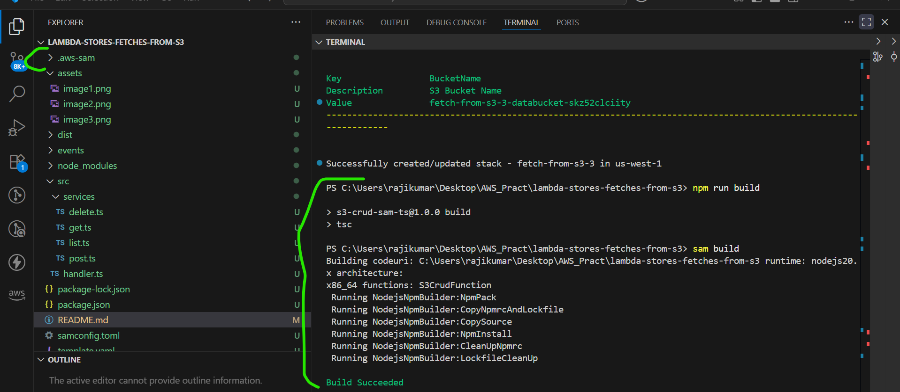
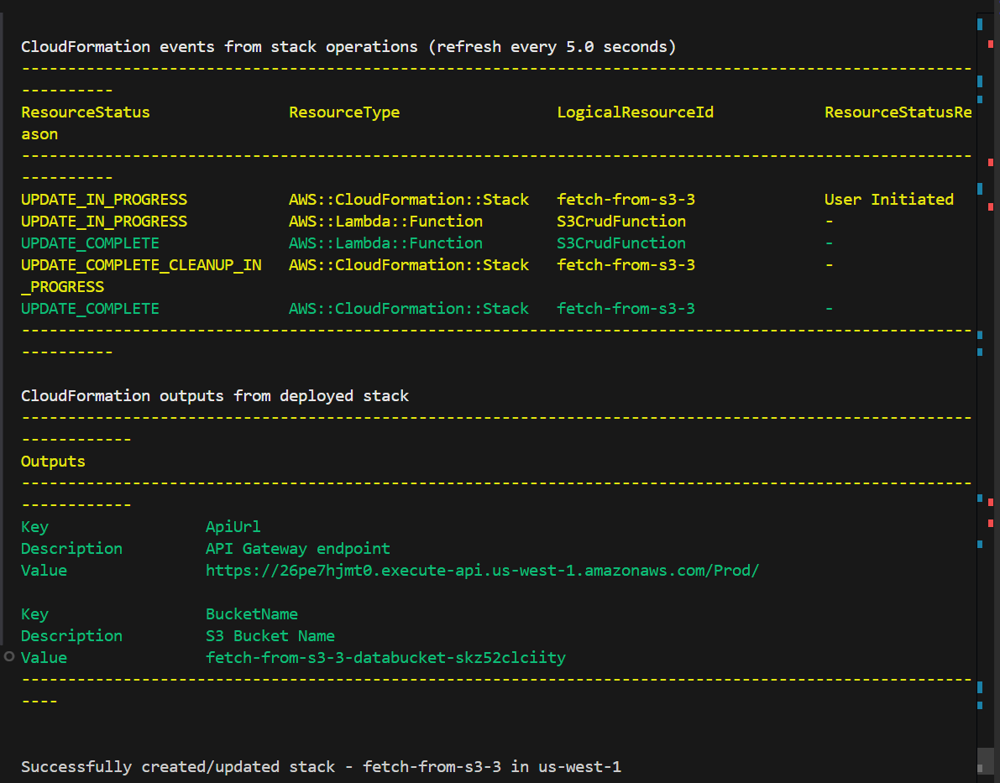
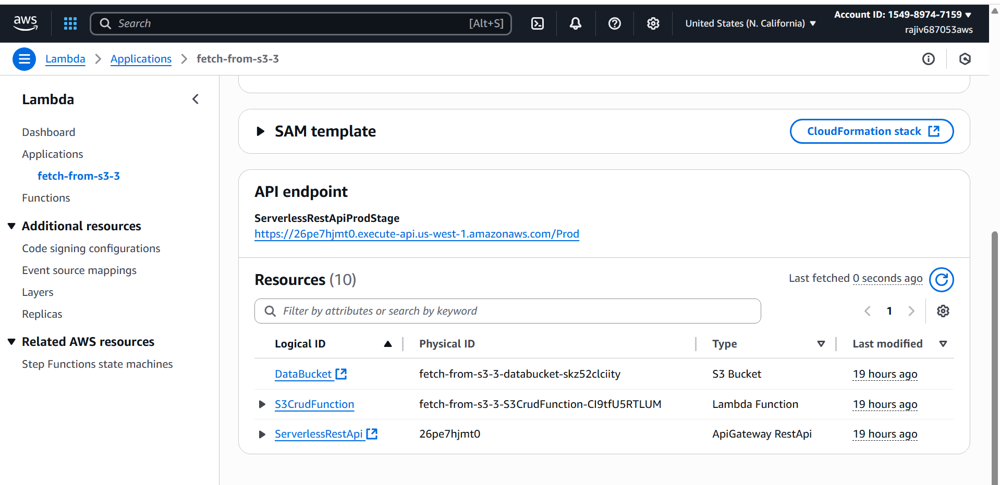
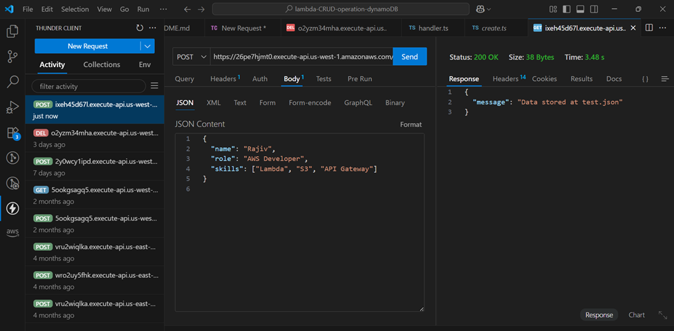
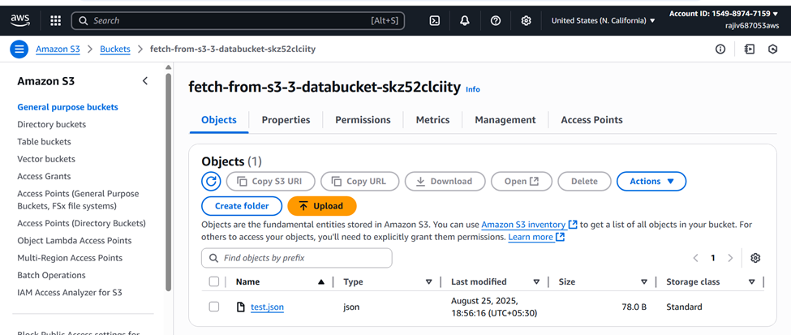
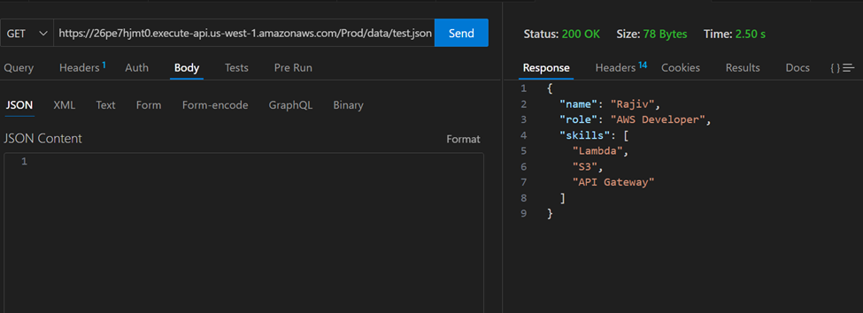
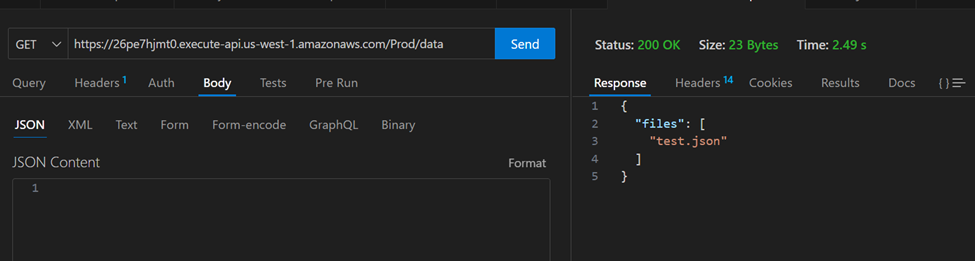
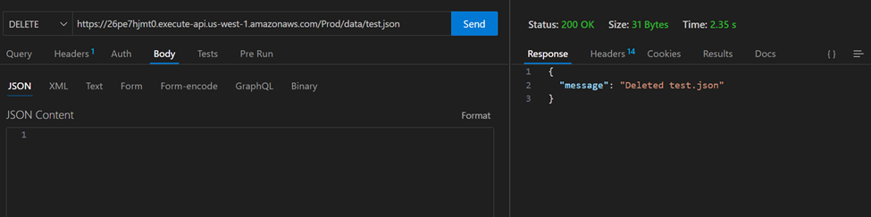
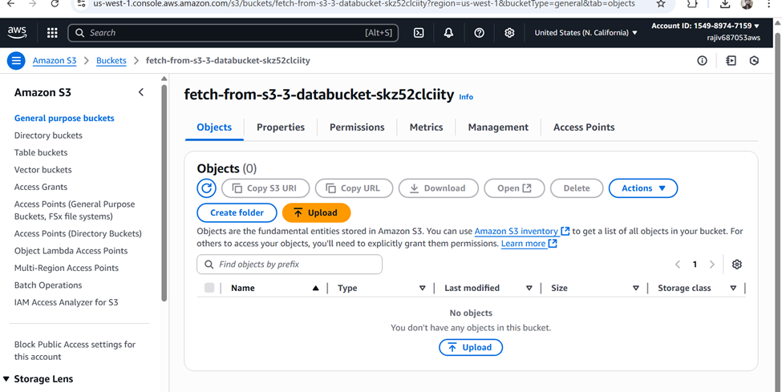

# Create a AWS lambda which stores, fetches data to n from s3 bucket. (TypeScript + SAM)

This project implements a **CRUD API** on S3 using **AWS Lambda**, **API Gateway**, and **TypeScript**.  
The Lambda functions are deployed using **AWS SAM**.

---

## 📁 Project Structure

```
project-root/
├── src/
│   ├── handlers/           # Lambda entry point
│   │   └── handlers.ts
│   └── services/           # Business logic for S3 CRUD
│       ├── get.ts
│       ├── post.ts
│       ├── delete.ts
│       └── list.ts
├── dist/                   # Compiled JS after tsc
├── package.json
├── tsconfig.json
└── template.yaml            # SAM template
```


---

## ⚙️ Setup

1. Install dependencies
```bash
npm install
```
2. Compile TypeScript
```bash
npm run build
```

3. Build SAM
```bash
sam build
```


4. Deploy
```bash
sam deploy --guided
```


---

## 📝 template.yaml Notes

- **Handler:** `dist/handlers/handlers.handler`  
- **Lambda Runtime:** `nodejs20.x`  
- **S3 Bucket:** Automatically created or referenced via `DataBucket` environment variable  
- **API Gateway Path:** `/data/{key}`  
- **Supported Methods:** `POST`, `GET`, `DELETE`

---

## 🔹 Lambda Handlers

**src/handlers/handlers.ts**
```ts
import { APIGatewayProxyEvent, APIGatewayProxyResult } from "aws-lambda";
import { getFunction } from "../services/get";
import { postFunction } from "../services/post";
import { deleteFunction } from "../services/delete";
import { listFunction } from "../services/list";

export async function handler(event: APIGatewayProxyEvent): Promise<APIGatewayProxyResult> {
  const method = event.httpMethod;
  const key = event.pathParameters?.key || "";

  try {
    switch (method) {
      case "POST":
        return await postFunction(event, key);
      case "GET":
        if (key) {
          return await getFunction(key);
        } else {
          return await listFunction();
        }
      case "DELETE":
        return await deleteFunction(key);
      default:
        return {
          statusCode: 405,
          body: JSON.stringify({ message: "Method Not Allowed" }),
        };
    }
  } catch (err: any) {
    return {
      statusCode: 500,
      body: JSON.stringify({ message: err.message }),
    };
  }
}
```

---

## 🔹 Services Examples

**src/services/get.ts**
```ts
import { S3 } from "aws-sdk";
const s3 = new S3();
const BUCKET = process.env.DataBucket || "";

export async function getFunction(key: string) {
  const data = await s3.getObject({ Bucket: BUCKET, Key: key }).promise();
  return {
    statusCode: 200,
    body: data.Body?.toString("utf-8") || "",
  };
}
```

Other services (`post.ts`, `delete.ts`, `list.ts`) follow a similar structure.

---

## 🔹 tsconfig.json

```json
{
  "compilerOptions": {
    "target": "ES2020",
    "module": "commonjs",
    "rootDir": "src",
    "outDir": "dist",
    "strict": true,
    "esModuleInterop": true
  },
  "include": ["src/**/*"]
}
```

---

## 🔹 package.json

```json
{
  "name": "lambda-s3-crud",
  "version": "1.0.0",
  "main": "dist/handlers/handlers.js",
  "scripts": {
    "build": "tsc",
    "start": "sam local start-api",
    "deploy": "sam deploy --guided"
  },
  "dependencies": {
    "aws-sdk": "^2.1488.0"
  },
  "devDependencies": {
    "typescript": "^5.4.0"
  }
}
```

---

## 🧪 Testing with Thunder Client

1. **Base URL:** `https://26pe7hjmt0.execute-api.us-west-1.amazonaws.com/Prod`

### POST — Create/Update
- URL: `/data/test.json`
- Method: `POST`
- Body:
```json
{
  "name": "Rajiv",
  "role": "AWS Developer",
  "skills": ["Lambda", "S3", "API Gateway"]
}
```

Created test.json inside s3 bucket: 



### GET — Fetch Single Object
- URL: `/data/test.json`
- Method: `GET`


### GET — List All Objects
- URL: `/data`
- Method: `GET`



### DELETE — Remove Object
- URL: `/data/test.json`
- Method: `DELETE`



Deleted from S3 bucket: 


**⚠️ Notes:**
- Make sure to include the stage name (`Prod`) in the URL.  
- Use the correct HTTP method for each endpoint.  
- If calling from browser, ensure Lambda returns **CORS headers**.

---

## ⚡ Tips

- Rebuild after any TypeScript change: `npm run build && sam build`  
- Check Lambda logs:
```bash
sam logs -n S3CrudFunction --stack-name <stack-name> --tail
```
- Ensure all service imports are relative to `src/handlers` (no `../src/...` paths)

---
